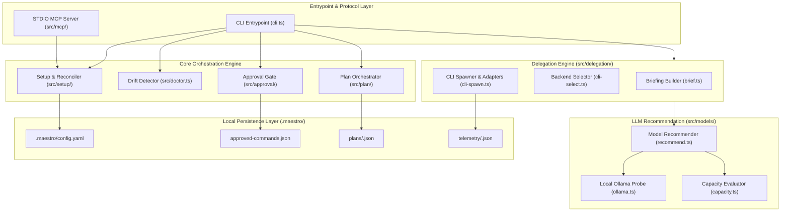
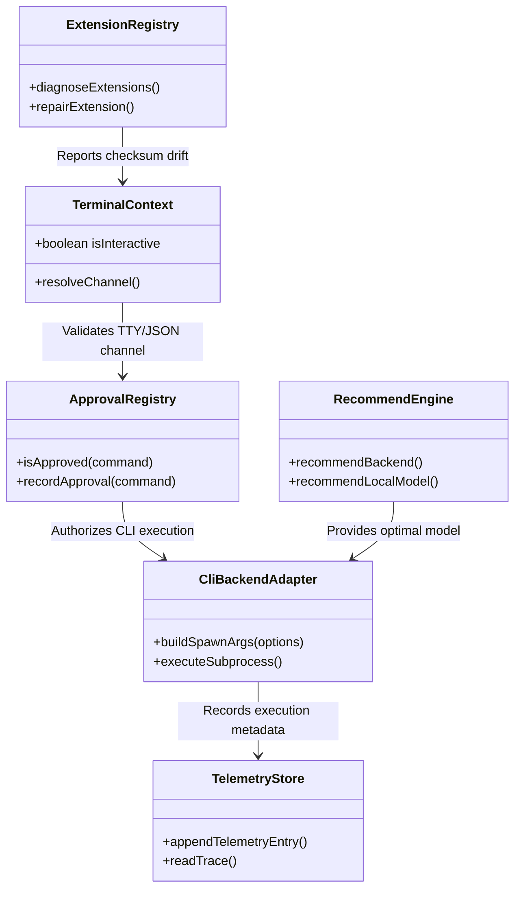

[← Back to Root Homepage](../README.md) | [Portal Index](README.md)

---

# System Design and Architecture of Maestro

<!-- specsfy:documentator:start -->
## Architectural Overview

**Maestro** is designed as a lightweight, declarative orchestration layer. Rather than reimplementing existing software development tools, the system orchestrates third-party subsystems and AI coding agents through a verifiable dependency contract.

The architecture is built upon a core design decision (**SPEC-0002**), categorizing dependencies into 3 distinct layers with explicit isolation policies:

| Layer | Examples | Management Policy |
| --- | --- | --- |
| **1. Local npm Subsystems** | `@promovaweb/specsfy`, `context-mode` | Strictly pinned version, resolved from local project copy (`node_modules/`). |
| **2. Local Python Subsystems** | `code-review-graph` | Isolated in local project `venv` (`.venv`), installed via `uv` upon prior explicit approval. Never installed globally. |
| **3. CLI Agent Backends** | `pi`, `agy`, `claude`, `codex`, `goose` | Dynamically detected in `PATH` by invocation capability. Interchangeable by design and never installed by Maestro. |

### Environment Golden Rule
> **Prefer local copies, accept global binaries resolved in PATH, never install tools globally or manually.**

---

## System Component Diagram

The following Mermaid diagram outlines the primary system components, from CLI entrypoints to subprocess orchestration and local persistence:

---

## Internal Module Diagram (`src/`)

Modules in `src/` are loosely coupled using dependency injection for deterministic unit testing:

---

## Security Boundaries & Confinement Diagram

Maestro enforces strict security boundaries to prevent permission leaks or accidental writes outside project scope:

```mermaid
graph LR
    subgraph HostEnv ["Host Environment (dev-env container)"]
        PATHBinaries["PATH Binaries (pi, agy, claude, codex, goose)"]
    end

    subgraph ProjectBoundary ["Target Project Root"]
        MaestroStorage[".maestro/ Config & Plans"]
        ClaudeSettings[".claude/settings.json Hooks"]
        SpecsfyDirectory[".specsfy/ Metadata & Specs"]
        VenvDirectory[".venv/ Python Environment"]
    end

    subgraph SecurityGuarantees ["Security & Confinement Rules"]
        Rule1["1. Exact argv matching enables registry bypass"]
        Rule2["2. Divergent extensions isolate to quarantine without overwrite"]
        Rule3["3. Subprocess CLI spawns do not capture stdout/stderr in telemetry"]
    end

    HostEnv -- Binary Probing --> ProjectBoundary
    ProjectBoundary --- SecurityGuarantees
```

---

## Architectural Domain Breakdown

### 1. Approval Gate Subsystem (`src/approval/`)
Prior to executing any installation or structural modification, Maestro renders an explicit execution plan and requests approval. Interactive terminal sessions prompt via atomic TTY reading (`tty-read.ts`). Non-interactive or automated environments receive plans and submit approvals via JSON over `stdin` (`decide.ts`). Malformed, empty, or negative inputs result in immediate write cancellation. Commands approved with identical binary and `argv` parameters are recorded in `.maestro/approved-commands.json` to bypass redundant prompts during legitimate reinstalls.

### 2. Multi-Agent Delegation Engine (`src/delegation/`)
Allows composing agent profiles and generating structured briefs (`brief.ts`) for host agent delegation. For agents configured with `runtime: cli`, Maestro instantiates dedicated backend adapters (`cli-backends/`) that build native invocations for `pi`, `agy`, `claude`, `codex`, and `goose`. Each agent execution passes through an independent secondary spawn gate and runs under configurable timeouts.

### 3. Offline LLM Recommendation Engine (`src/models/`)
Evaluates local system capacity offline. When the local Ollama service is active, the module probes available RAM/GPU memory and checks the required context window length per task type (configured in `.maestro/config.yaml`). Insufficient context windows discard models prior to memory sizing evaluation.

### 4. Extension & Quarantine Manager (`src/extensions/`)
Enables custom local rules and hooks (`maestro extension create`) backed by SHA-256 hashes in `.maestro/extensions.json`. When `maestro doctor` detects a checksum mismatch (*drift*), `maestro extension repair` isolates the modified file into `.maestro/quarantine/` to preserve user work before restoring the original version.

### 5. MCP Server (`src/mcp/`)
Provides integration for IDEs via the Model Context Protocol over STDIO (`maestro-mcp`). The server validates project root paths strictly (`validateRoot`) to prevent accidental operations in incorrect workspace directories.
<!-- specsfy:documentator:end -->
