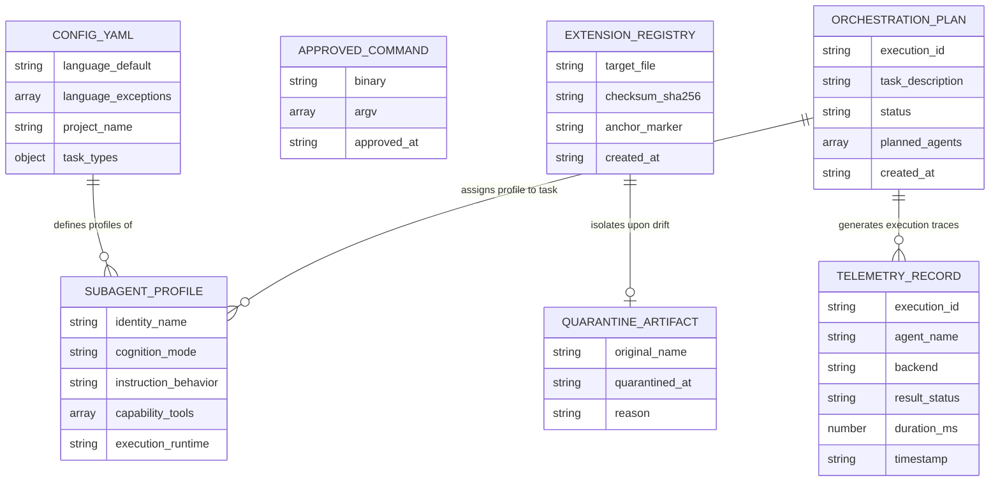

[← Back to Root Homepage](../README.md) | [Portal Index](README.md)

---

# Persistence and Data Storage Schemas in Maestro

<!-- specsfy:documentator:start -->
## Persistence Overview

**Maestro** does not use a traditional relational database management system (RDBMS) or dedicated NoSQL server. In alignment with principles of being a declarative, local, and version-auditable CLI tool, all system persistence relies on **structured local files** (JSON and YAML).

Project persistence is divided into two primary areas:
1. **Maestro Configurations and Records (`.maestro/`)**: Structured files maintained at the user's project root.
2. **Editor Integration Artifacts (`.claude/`, `.specsfy/`)**: Hook configurations and integrated specification manifests.

---

## File Structure and Data Schemas (`.maestro/`)

```
.maestro/
├── config.yaml               # Global configuration (agent profiles, language rules, task types)
├── approved-commands.json    # Approved commands registry with exact argv matching for approval bypass
├── extensions.json          # SHA-256 checksums and HTML anchor markers of active local extensions
├── plans/                    # Generated and approved multi-agent orchestration plans
│   └── <execution-id>.json   # Complete approved plan structure
├── telemetry/                # Structured CLI execution metrics (without stdout/stderr capture)
│   └── <execution-id>.json   # Metrics tracking duration, status, exit code, and timestamps
├── subagents/                # Customizable user subagent profiles
│   └── <agent>/             # YAML/MD files defining the 5 profile characteristic groups
└── quarantine/               # Divergent extension content isolated by the repair engine
```

---

## Entity-Relationship (ER) Diagram

The following Mermaid ER diagram details the logical entity structures stored in local persistence files:



---

## Entity Schema Breakdown

### 1. `config.yaml` (`.maestro/config.yaml`)
Primary configuration file created and kept complete by `maestro setup`.
- **`language`**: Defines `default` (response language) and `exceptions` (paths allowed to use localized languages).
- **`project`**: Stack fields automatically synchronized from `.specsfy/STACK.md` (when Specsfy is active).
- **`system`**: Environment profile and hardware resource definitions.
- **`maestro.subagents`**: Subagent profiles registered in the system.
- **`maestro.task_types`**: Task type definitions and their required minimum context window sizes.

### 2. `approved-commands.json` (`.maestro/approved-commands.json`)
Stores the list of commands explicitly approved by the user via the approval gate.
- **Format**: Array of objects containing `binary` (executable path) and `argv` (exact array of string arguments).
- **Validation Rule**: Any modification in `argv` (e.g. version change or new parameter) invalidates bypass, forcing a new human approval prompt.

### 3. `extensions.json` (`.maestro/extensions.json`)
Integrity registry of local extensions and rules created via `maestro extension create`.
- **Structure**: Maps each extension name to its `target_file`, content hash (`checksum_sha256`), and HTML anchor marker.
- **Diagnostic Usage**: `maestro doctor` compares disk file hashes against recorded hashes to detect third-party alterations (*drift*).

### 4. Orchestration Plans (`.maestro/plans/<execution-id>.json`)
Immutable representation of a multi-agent execution plan generated by `maestro plan` and approved by the user.
- Contains the list of planned agents, composed behaviors, recommended model assignments, and active tool permissions.

### 5. Telemetry and Spawning Logs (`.maestro/telemetry/<execution-id>.json`)
Structured telemetry tracking attempt metrics for agents executed with `runtime: cli`.
- **Fields**: `execution_id`, `agent`, `backend`, `model`, `result` (`executed`, `gate_rejected`, `tools_unsupported`, `spawn_failed`), `exit_code`, `timestamp`, and `duration_ms`.
- **Privacy Guarantee**: **Never** records `stdout` or `stderr` subprocess output, protecting API tokens, credentials, or sensitive code content.
<!-- specsfy:documentator:end -->
