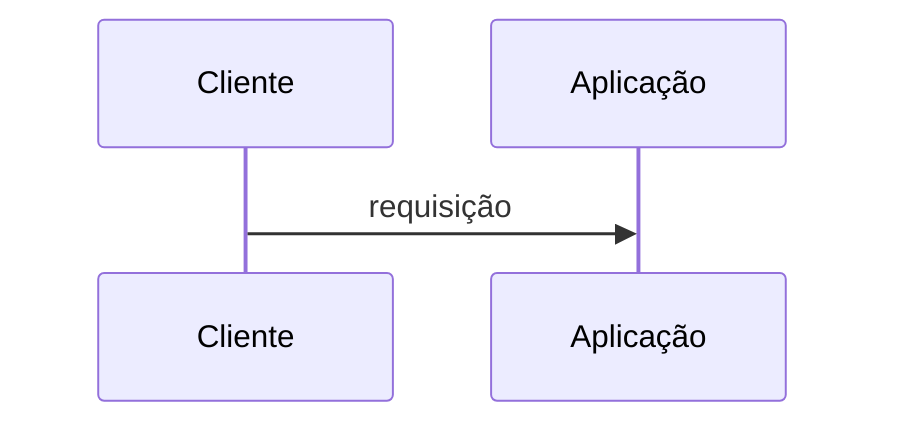
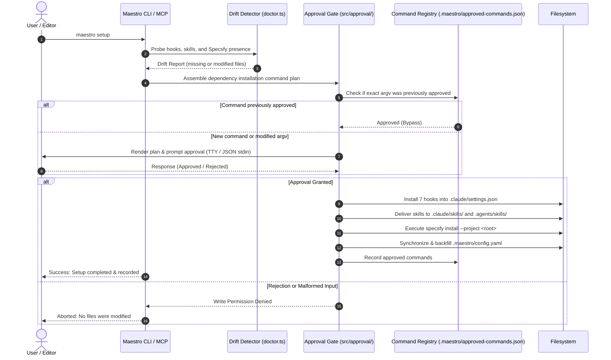
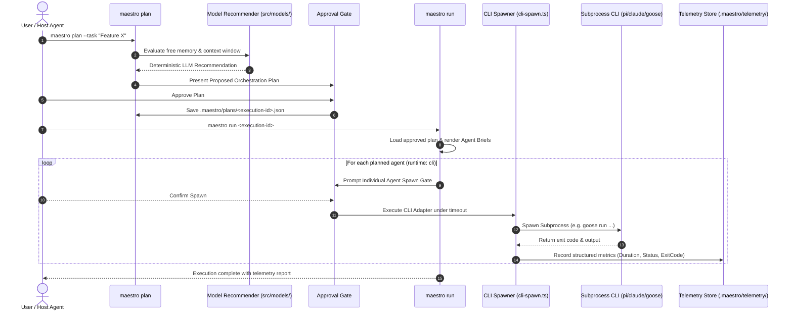
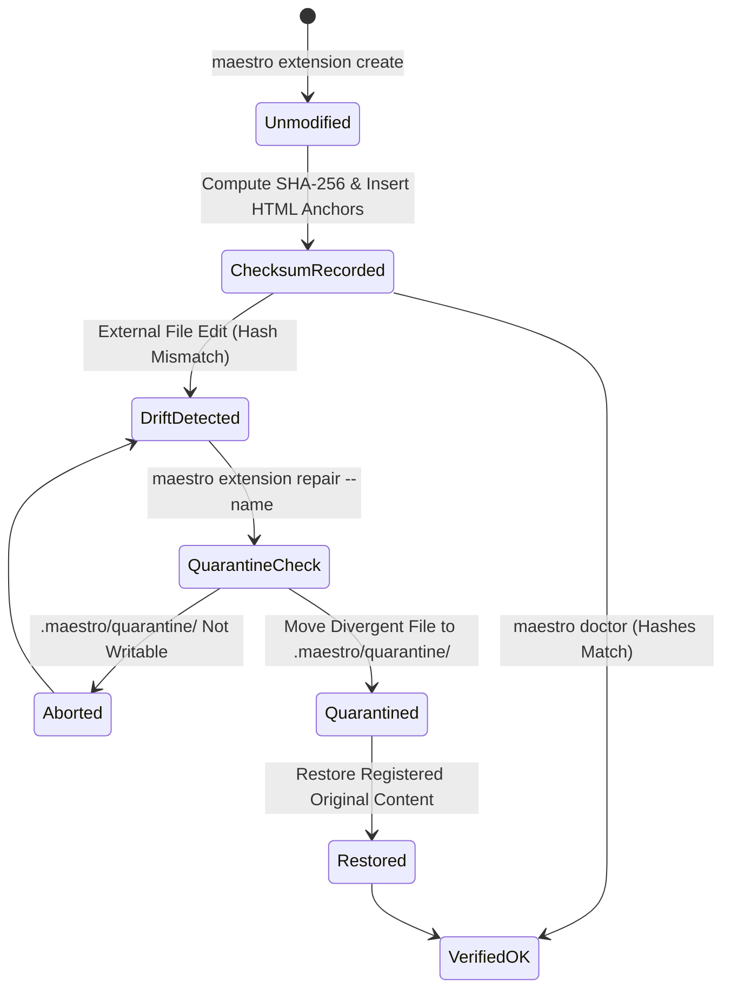

[← Back to Root Homepage](../README.md) | [Portal Index](README.md)

---

# Execution Flows of Maestro

<!-- specsfy:documentator:start -->
## Fluxo principal

<!-- specsfy:documentator:end -->

<!-- O bloco specsfy:documentator acima é o inventário mecânico gerado pelo Specsfy e é reescrito a cada build (findings/external/FIND-EXT-001). A documentação do projeto vive fora dele, a partir daqui. -->

## Flow Overview

**Maestro** operates as a strict pipeline of verification and execution. All primary workflows (setup, planning, execution, and repair) adhere to the principle of **preventive verification before state modification**, ensuring full user transparency over disk writes and process execution.

---

## 1. Bootstrapping and Reconciliation Flow (`maestro setup`)

`maestro setup` verifies whether hooks, skills, and the Specsfy framework are present on disk. When drift or missing files are detected, the system calculates an execution plan and requests human approval prior to applying changes.

---

## 2. Multi-Agent Planning and Execution Flow (`maestro plan` / `maestro run`)

This workflow details the complete lifecycle from task specification to external CLI agent subprocess spawning and telemetry logging.

---

## 3. Extension Management and Quarantine Repair State Diagram (`extension create` / `repair`)

The state diagram below illustrates extension integrity checking and the non-destructive quarantine recovery lifecycle:

