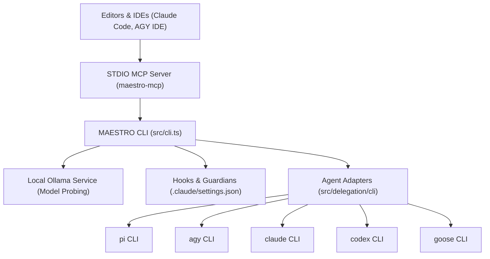

[← Back to Root Homepage](../README.md) | [Portal Index](README.md)

---

# Integrations and External Backends of Maestro

<!-- specsfy:documentator:start -->
## Integrations Overview

**Maestro** integrates with code editors, local language model services, and multiple third-party CLI agent backends. Adhering to system principles, Maestro **never modifies external tool source code or binaries**, operating strictly through official APIs, command-line interfaces, and configuration hooks.

---

## Detailed Integration Breakdown

### 1. CLI Agent Backend Adapters (`src/delegation/cli-backends/`)
Maestro includes dedicated adapters for 5 supported CLI agent backends. Each adapter translates model choices, context rules, and tool permissions into native CLI flags:

| Backend | Behavior Configuration Mechanism | Native Tool Support | Integration Notes |
| --- | --- | --- | --- |
| **`pi`** | Context passed via native CLI arguments | Yes | Direct execution without temporary files. |
| **`agy`** | Generates temporary isolated `AGENTS.md` at root | No (Prompt restriction) | Temporary file is always cleaned up post-execution. |
| **`claude`** | Native system prompt flag (`--system-prompt`) | Yes | Supports strict tool permission enforcement. |
| **`codex`** | Generates temporary isolated `AGENTS.md` at root | No | Temporary file is removed immediately post-execution. |
| **`goose`** | Injected via Goose configuration parameters | Yes | Synchronous execution with exit status capture. |

### 2. Local Ollama Integration (`src/models/ollama.ts`)
- **Protocol**: HTTP REST API calls to the local Ollama daemon (default port `11434`).
- **Probing**: Queries `/api/tags` to list installed models, converting reported sizes into raw bytes.
- **Capacity Evaluation**: Calculates whether model weights fit in available system RAM/GPU memory and checks context window requirements before making recommendations.

### 3. Claude Code Editor Integration (`src/hooks/claude-code.ts`)
`maestro setup` translates and installs 7 guardian and context hooks into `.claude/settings.json`:
- **`guard-destructive`**: Intercepts terminal commands to block destructive operations (`rm -rf /`, `git push --force`, `git reset --hard`).
- **`guard-secrets`**: Intercepts accidental leakage of API keys, tokens, or credentials.
- **`context-mode`**: Connects the `context-mode` MCP plugin for context window optimization.
- **`code-review-graph`**: Connects the static analysis code graph in Python.
- **`commit-authorship`**: Preserves author attribution rules for commits.

### 4. Model Context Protocol - MCP (`src/mcp/`)
- **Binary**: `maestro-mcp`.
- **Protocol**: STDIO transport following JSON-RPC 2.0.
- **Tool (`setup`)**: Exposes environment reconciliation identical to the CLI command. Requires `projectRoot` parameter to prevent accidental operations in incorrect workspace directories.

### 5. Environment Variable Management and Security
- **Secret Isolation**: Maestro reads public configuration keys (such as `PATH`, `HOME`, `SHELL`, `LANG`).
- **No Secret Leakage**: Sensitive environment variables and API tokens are never written to disk or recorded in telemetry files under `.maestro/telemetry/`.
<!-- specsfy:documentator:end -->
