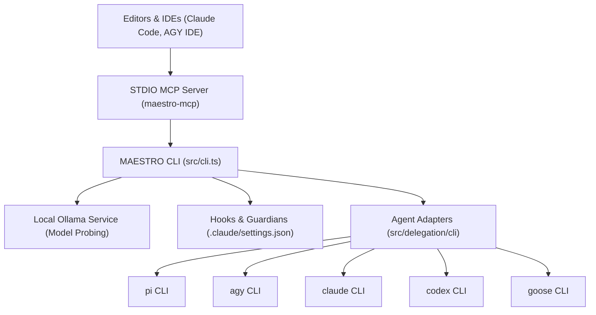

[← Back to Root Homepage](../README.md) | [Portal Index](README.md)

---

# Integrations and External Backends of Maestro

<!-- specsfy:documentator:start -->
## Configuração

Valores de ambiente e integrações são documentados apenas pelos nomes declarados localmente, sem segredos.
<!-- specsfy:documentator:end -->

<!-- O bloco specsfy:documentator acima é o inventário mecânico gerado pelo Specsfy e é reescrito a cada build (findings/external/FIND-EXT-001). A documentação do projeto vive fora dele, a partir daqui. -->

## Integrations Overview

**Maestro** integrates with code editors, local language model services, and multiple third-party CLI agent backends. Adhering to system principles, Maestro **never modifies external tool source code or binaries**, operating strictly through official APIs, command-line interfaces, and configuration hooks.

---

## Detailed Integration Breakdown

### 1. CLI Agent Backend Adapters (`src/delegation/cli-backends/`)
Maestro includes dedicated adapters for 5 supported CLI agent backends. Each adapter translates model choices, context rules, and tool permissions into native CLI flags:

| Backend | Behavior Configuration Mechanism | Native Tool Support | Integration Notes |
| --- | --- | --- | --- |
| **`pi`** | Context passed via native CLI arguments | Yes | Direct execution without temporary files. |
| **`agy`** | Generates temporary isolated `AGENTS.md` at root | No (Prompt restriction) | Temporary file is always cleaned up post-execution. |
| **`claude`** | Native system prompt flag (`--system-prompt`) | Yes | Supports strict tool permission enforcement. |
| **`codex`** | Generates temporary isolated `AGENTS.md` at root | No | Temporary file is removed immediately post-execution. |
| **`goose`** | Injected via Goose configuration parameters | Yes | Synchronous execution with exit status capture. |

### 2. Local Ollama Integration (`src/models/ollama.ts`)
- **Protocol**: HTTP REST API calls to the local Ollama daemon (default port `11434`).
- **Probing**: Queries `/api/tags` to list installed models, converting reported sizes into raw bytes.
- **Capacity Evaluation**: Calculates whether model weights fit in available system RAM/GPU memory and checks context window requirements before making recommendations.

### 3. Claude Code Editor Integration (`src/hooks/`)
`maestro setup` installs the canonical hooks from `resources/hooks/` plus the context-mode projection into `.claude/settings.json` (SPEC-0022):
- **`guard-destructive`**: Intercepts terminal commands to block destructive operations (`rm -rf /`, `git push --force`, `git reset --hard`).
- **`guard-secrets`**: Intercepts accidental leakage of API keys, tokens, or credentials.
- **`protect-authorship`**: Blocks commits that credit an AI agent as co-author.
- **`setup-check`**: At session start, reports a project whose setup is incomplete.
- **`code-review-graph-update`**: Dispatches the static analysis code graph in Python.
- **`context-mode-*`**: Projected from the installed package's own `hooks/hooks.json` (`src/hooks/upstream.ts`), so events and matchers always follow the upstream.
- **`skills-project-session`**, **`skills-project`** (SPEC-0024): additive copy of `.agents/skills` into `.claude/skills` at session start and right after `skills add`/`specsfy skills`, because the Claude Code does not read `.agents/skills`.
- **`code-review-graph-stop`**, **`graph-hint`**, **`guard-docs`** (SPEC-0023): turn-end graph refresh, one-per-session graph reminder before `Grep`/`Glob`, and protection against the Specsfy documentator build without `--check`.

Tool resilience (SPEC-0023): the script preamble exposes `HOOK_TOOL`, `HOOK_SESSION` and `HOOK_COMMAND` extracted from `command`, `code` (+`language`) or `commands[]`, so the guards match `Bash|mcp__.*(execute|run_in_terminal|shell).*` and give the same verdict in any shell tool; `code-review-graph-update` fires on `Edit|Write|MultiEdit|NotebookEdit|Bash|mcp__.*` and only runs the CLI when the working-tree hash in `.maestro/state/` changed; a fragment can emit `additionalContext` by setting `context`; known binaries reach fragments as `MAESTRO_BIN_*` variables. Text rules are limited to the `maestro: hooks fallback` block (three lines conditioned on `maestro doctor`).

Mechanics: a hook with a script fragment is written to `.maestro/hooks/<name>.sh` (registered by checksum, drift quarantined) and `settings.json` only references it, with a `matcher` derived from the event or the hook's `tools:` override (`src/hooks/claude-code.ts`); a dispatch hook is installed without wrapper and carries a `# maestro:hook=<name>` identity marker (`src/hooks/identity.ts`); the settings merge preserves every third-party entry and migrates the previous inline format (`src/setup/write.ts`); dispatch binaries resolve at runtime through a POSIX shim that prefers the recorded path and falls back to `PATH` (`src/hooks/shim.ts`).

### 4. Model Context Protocol - MCP (`src/mcp/`)
- **Binary**: `maestro-mcp`.
- **Protocol**: STDIO transport following JSON-RPC 2.0.
- **Tool (`setup`)**: Exposes environment reconciliation identical to the CLI command. Requires `projectRoot` parameter to prevent accidental operations in incorrect workspace directories.

### 5. Environment Variable Management and Security
- **Secret Isolation**: Maestro reads public configuration keys (such as `PATH`, `HOME`, `SHELL`, `LANG`).
- **No Secret Leakage**: Sensitive environment variables and API tokens are never written to disk or recorded in telemetry files under `.maestro/telemetry/`.

Instruction files (SPEC-0024): every maestro block lives in `AGENTS.md` under the same names for all targets; `CLAUDE.md` carries only the anchored `@AGENTS.md` import. Older layouts are migrated by moving registered artifacts (`src/extensions/migrate.ts`), third-party sections with a known signature (`## Agent skills`) are relocated and tracked as `foreign` (`src/extensions/foreign.ts`), and skills are projected from the canonical `.agents/skills` with per-copy checksums (`src/skills/project.ts`).

### 6. Doctor orchestration and "configured" criterion (`src/doctor/`, `src/setup/layout.ts`) — SPEC-0025

`expectedLayout()`/`assessConfiguration(root, target)` (`src/setup/layout.ts`) are the single source both `setup` and `doctor` import for what a fully configured project looks like: the canonical hooks read straight from `resources/hooks/`, the shared `AGENTS.md` blocks, and the on-disk trail `specsfy-setup` (`PROJECT.md`, `.specsfy/STACK.md`, `.specsfy/RULES.md`, `.specsfy/USER-PROFILE.md`) and `setup-matt-pocock-skills` (`## Agent skills` in `AGENTS.md`) leave behind — never a flag the maestro writes about itself. `nextStepsNote()` turns that gap into the `next: run …` line the setup report and the generated README carry while anything is pending.

`maestro doctor` (`src/doctor.ts`, `src/cli.ts`) composes two new layers on top of the existing dependency/skills/extension/agent checks:
- **Subsystems** (`src/doctor/subsystems.ts`): runs `specsfy doctor`, `context-mode doctor`, `skills list` and `code-review-graph status` through an injectable, timeout-bound executor; each reports its own `OK`/`FAIL`/`ABSENT`, and one subsystem's failure never stops the others.
- **Maestro layer** (`src/doctor/maestro.ts`): reads `assessConfiguration` and classifies each gap as `FAIL` (something `setup` would repair — a legacy hook entry, a missing script, a block still in the pre-SPEC-0024 direction, an anchor marker without a matching pair, a `hooks-fallback` rule pointing at a hook with no installed script) or `WARN` (a pending conversational step, a projected skill that diverged from its source, or unrecognized content in `CLAUDE.md` — never something the maestro can fix by itself).

The doctor never writes; `exitCode` moves to `1` on any `FAIL` (dependency, subsystem, or maestro layer) but never on a `WARN`. `maestro setup` also stopped skipping the skills/Specsfy installers just because their directories already existed — they're idempotent by construction, so they now run on every call where they're configured, and only the approval prompt is still skipped when the exact command was approved before.
